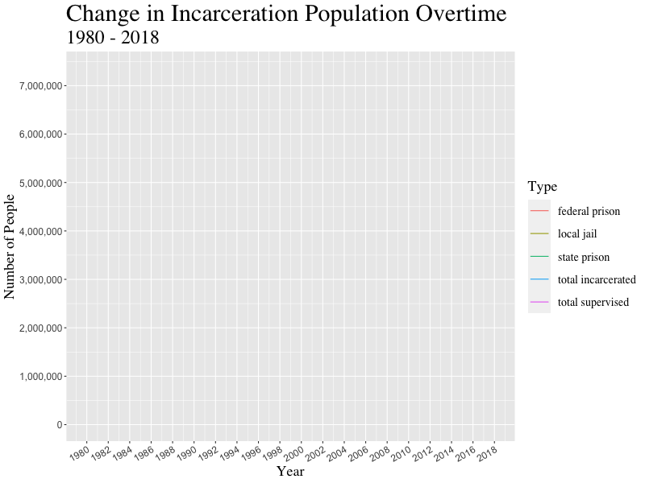
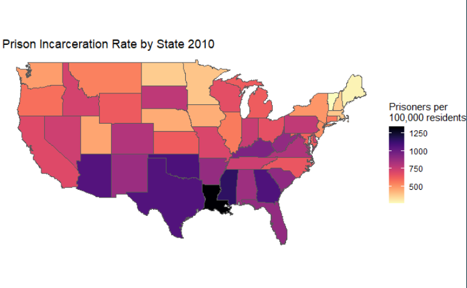
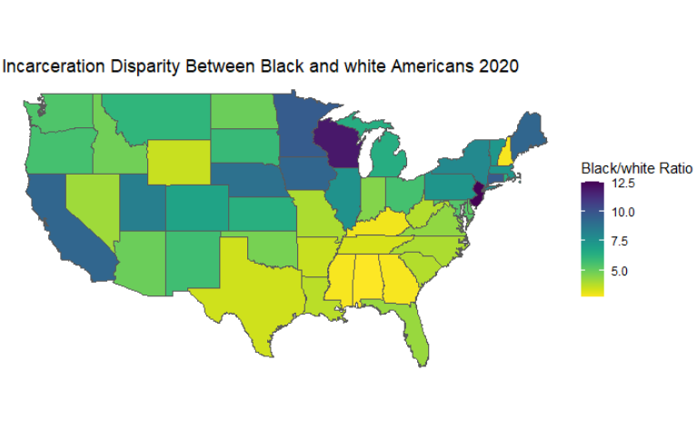

```{r setup, include = FALSE}
library(tidyverse)
library(kableExtra)
library(viridis)
library(scales)
library(readxl)
library(mdsr)
library(dplyr)
library(knitr)
library(ggplot2)
library(gganimate)
library(gifski)
library(janitor)
library(viridis)
library(sf)
library(tigris) # geojoin
library(leaflet) # interactive maps
library(htmlwidgets) # interactive map labels

# Set code chunk defaults 
knitr::opts_chunk$set(echo = FALSE, 
                      mesage = FALSE,
                      warning = FALSE,
                      fig.align = "center")

# Set R environment options
options(knitr.kable.NA = '')
incarceration_populations <-  read_csv("incarceration_populations.csv")

```

# Introduction
](img/Mass-Incarceration_TheNewYorker.jpeg)

Mass incarceration in the United States is a relatively recent phenomenon. As documented in books such as The New Jim Crow: Mass Incarceration in the Age of Colorblindness and documentaries such as 13th, mass incarceration is the latest iteration of American society’s efforts to keep Black Americans, as well as other non-white racial and ethnic groups, in second-class citizenship status.

What makes mass incarceration unique is that the laws driving the disproportionate incarceration of Black Americans make no mention of race. Michelle Williams, the author of The New Jim Crow shows how The War on Drugs played a leading role in the incarcerated population rising by over 300% between 1980 and 2018 (Source: Bureau of Justice Statistics). In contrast, the population of the United States only increased by about 65% according to the US census. 

Mass incarceration has persisted even as the crime rate has been dropping consistently since the early 1990s. As a result, the United States currently makes up about 5% of the world’s population but has nearly 25% of the world’s prisoners.

Our project’s goal is to use datasets we acquired online to illustrate mass incarceration’s takeover state-by-state and county-by-county from 1970 onward. Most Americans know that mass incarceration exists, but few know when incarceration rates first spike in their community. More broadly, we hope the data science tools we have applied to the dataset help answer both broad and narrow questions about the when, where, and why of mass incarceration in America.

# Data
The datasets we used include incarceration trends by U.S. counties from 1970 - 2018 from [the Vera Institute of Justice](https://github.com/vera-institute/incarceration-trends), prison population counts from [the Bureau of Justice Statistics (BJS)](https://bjs.ojp.gov/data/key-statistics), incarceration rates and ratio by race from [the Prison Policy Initiative](https://www.prisonpolicy.org/racialgeography/report.html) and [the Sentencing Project](https://www.sentencingproject.org/the-facts/#map). 
All raw datasets are downloaded and imported into RStudio before the wrangling process. 

For developing interactive maps, we also downloaded the cartographic boundary shapefile of counties from the [U.S. Census Bureau](https://www.census.gov/geographies/mapping-files/time-series/geo/carto-boundary-file.html).

# Change in Incarceration Population
The “tough-on-crime” rhetoric characterized American politics during the 1980s and ’90s. It appeals to people's worst fears regarding their safety and perpetuates a framing that has justified for the racial profiling, police brutality, and unreasonably harsh sentencing that have together contributed to the rise of mass incarceration. Below, we utilized datasets that described population statistics surrounding incarceration from 1980 to 2018 to create an animation that shows the dramatic climbing of the population in prisons and jails. We juxtaposed trends of different variables to see the possibilities of associations among them and examine whether certain gaps are widening or closing. 

```{r, echo=FALSE, out.width = '75%'}

```

The visualization shows the amount of people under supervision, in jails and prisons in the United States from 1980 through 2018. The population under supervision grew extremely fast starting in 1980 and peaked in 2007 before it started slowly decreasing. The number of people almost quadrupled, from around 2,000,000 to almost 8,000,000, over the course of 30 years. The incarcerated population also grew dramatically fast between 1980 and 2007 from 500,000 to well over 2,000,000. Since then the incarcerated population has started to decrease but only slightly. The population in local jails and state prisons also grew significantly under the same time frame. 

Surprisingly, the federal prison population didn't grow much relatively. As mentioned in the Introduction, during the 1970s and ’80s, the federal government dramatically escalated its [war on drugs](https://www.history.com/topics/crime/the-war-on-drugs). This led to millions of people getting locked up for low-level drug offenses, causing the US prison population to spike. The standard narrative therefore goes: it's mainly the federal government that's behind mass incarceration. However, our findings help refute such myth. The prison system that the federal government runs is huge, but [many states](https://www.worldatlas.com/articles/the-largest-jails-in-the-united-states.html) also have systems that are fairly close to the federal one in size. Moreover, there are other types of correctional observation including local jail, parole, and probation. In light of all these massive state-operated structures, the federal prison falls out of first place in regards of leading mass incarceration.

Our findings also support the claim of Fordham University criminal justice expert [John Pfaff](https://www.vox.com/policy-and-politics/2017/5/30/15591700/mass-incarceration-john-pfaff-locked-in). "The federal government’s war on drugs never played much of a role in incarceration because the federal government just doesn’t play much of a role in incarceration overall," said Pfaff.

All 5 types of correctional observations display a trend of slight decrease starting in 2007. According to [PEW](https://www.pewtrusts.org/en/research-and-analysis/issue-briefs/2017/03/state-reforms-reverse-decades-of-incarceration-growth), since 2007, more than 30 states have enacted policies to reverse incarceration growth and costs, while maintaining the long-term, nationwide decline in the crime rate that began in the early 1990s. These changes are crucial for the dismantling of the prison industrial complex, while we also have to keep in mind that the United States remains as the world leader in its rate of incarceration, locking up its citizens at 5-10 times the rate of other industrialized nations. According to [the Sentencing Project](https://sentencingproject.salsalabs.org/the_daily_show_copy1?wvpId=f073b5eb-b9c5-11e7-b163-12c35146c141), at the current rate of decline it will take 75 years to cut the prison population by 50%.

Despite the slight descreases, these trends have continue to result in prison overcrowding and fiscal burdens on states to accommodate a rapidly expanding penal system, despite [increasing evidence](https://www.vera.org/downloads/publications/for-the-record-prison-paradox_02.pdf) that large-scale incarceration is not an effective means of achieving public safety.

Below is the main code that we used to make the time lapse visualization. First, we pivoted longer the incarceration populations dataset. Then, we used `ggplot` to create static plots that show trends of multiple variables and used `gganimate` to bring it from a static plot to a timelapse.

```{r animation code, echo = TRUE}
incarceration_populations_longer <- incarceration_populations %>%
  select(year, total_supervised, total_incarcerated, local_jail, state_prison, federal_prison) %>%
  pivot_longer(!year, names_to = "variables", values_to = "counts") %>%
  mutate(variables = as.factor(variables))

incarceration_time_animation <- ggplot(data = incarceration_populations_longer, aes(x = year, y = counts)) + 
  geom_line(aes(group = variables, color = variables)) +
  labs(title = "Change in Incarceration Population Overtime",
       subtitle = "1980 - 2018",
       x = "Year",
       y = "Number of People",
       color = "Type") +
  theme(plot.title = element_text(family = "serif", size = 20),
        plot.subtitle = element_text(family = "serif", size = 15),
        axis.text.x = element_text(angle = 30, hjust = 1, size = rel(1))) +
  scale_y_continuous(labels = comma) +
  scale_x_continuous(breaks = seq(1980, 2018, by = 2)) +
  transition_reveal(year)
```

# Incarceration Rates by States (2020)

```{r, echo=FALSE, out.width = '100%'}

```
This map shows incarceration rates near the peak of incarceration in the United States. In general, southern states had higher incarceration rates, but barely any states had incarceration rates below 500 prisoners per 100,000 residents. This is still extremely high considering that the UN estimates that the average rate around the world is about 145 per 100,000. https://www.prisonstudies.org/sites/default/files/resources/downloads/wppl_12.pdf To put this into perspective any state in the purple has 1% of its population behind bars.

# Racial Contrast

```{r, echo=FALSE, out.width = '100%'}

```

<<<<<<< HEAD
Interestingly, when it comes to racial disparity in incarceration rates Southern states have much less disparity. Many of the states that are considered relatively liberal like California and New York actually have some of the higher rates of disparity. This could be in part to laws that are unique to each state. In the case of California, a law known colloquially as "Three Strike, You're Out". This law was designed to address habitual offenders by automatically increasing their sentence to 25 to life after committing three crimes. Only one of these crimes had to be serious or violent which has led many people to go to prison for non-violent offenses such as drug possession. According to a [study]((http://www.cjcj.org/uploads/cjcj/documents/three_strikes_the_new_apartheid.pdf)) conducted by the Center of Juvenile and Criminal Justice in 1996 only a year after the law's implementation found that black defendants made 43% of all three-strikes defendants.This obviously lead to even higher incarceration rates for Black Californians who already made up 31% of the state prisoner population at the time while only comprising 7% of California's total populations. On top of this the law haas not been proven to reduce crime rates, but still remains in effect.

In New York, the stop-and-frisk laws in New York City may be an explanation for the relatively high disparity between Black and white incarceration rates. Stop-and-frisk laws allowed police
>>>>>>> 2c08e8b483343de6f5e9a548becf3034b97e9d94


# Interactive Map by County


# Table of State Data

# Conclusion and Limitations

## Citations
* Alexander, Michelle. The New Jim Crow: Mass Incarceration in the Age of Colorblindness. New York, The New Press, 2010.
* Vera Institute. 2018. Incarceration Trends: GitHub; [2021 Nov]. https://github.com/vera-institute/incarceration-trends. 


## Header 2 (Subsection heading)

### Header 3 (Subsubsection heading)

This is an R Markdown document. Markdown is a simple formatting syntax for authoring HTML, PDF, and MS Word documents. For example, you can include **Bold** and _Italic_ and `Code` text.  For more details on using R Markdown see <http://rmarkdown.rstudio.com>.

You should test out updating your GitHub Pages website:

* clone your group's blog project repo in RStudio
* update "Your Project Title Here" to a new title in the YAML header
* knit `index.Rmd` (we will now knit to HTML by default instead of pdf)
* commit and push **both** `index.Rmd` and `index.html`
* go to https://stat231-f21.github.io/blog_facts-and-stats/ to see the published test document (this is publicly available!)

## Including code and plots

You can embed code as normal, for example:

```{r cars}
summary(cars)
```

Let's clean up the format of that output instead of using the standard R output:

```{r pretty-table, echo = TRUE}
summary(cars) %>%
  kable(col.names = c("Speed", "Distance"),
        row.names = FALSE) %>%
  kable_styling(bootstrap_options = "striped",
                full_width = FALSE) %>%
  row_spec(0, bold = TRUE) %>%
  column_spec(1:2, width = "1.5in") 
```

In a study from the 1920s, fifty cars were used to see how the speed of the car and the distance taken to stop were related.  Speeds ranged between `r min(cars$speed)` and `r max(cars$speed)` mph.  Distances taken to stop ranged between `r min(cars$dist)` and `r max(cars$dist)` feet, with the middle 50% falling between `r as.numeric(quantile(cars$dist)[2])` and `r as.numeric(quantile(cars$dist)[4])` feet.  

You can also embed plots as normal, for example:

```{r figure1}
ggplot(data = cars, aes(x = speed, y = dist)) + 
  geom_point() + 
  labs(x = "Speed of car (mph)",
       y = "Distance taken to stop (ft)",
       title = "Stopping distance increases with faster speeds",
       subtitle = "Based on 1920s study") +
  theme_classic()
```

Take note of the default code chunk options in the `setup` code chunk, and adjust individual code chunk options as needed. for example, unlike the rest of the Rmd files we worked in this semester, the default code chunk option is `echo = FALSE`, so you will need to set `echo  = TRUE` for any code chunks you would like to display in the blog. 


## Including links and images/videos

You can include [links](https://www.datadreaming.org/post/r-markdown-theme-gallery/) and there are a few ways to embed  images! Both options for embedding images below can be used interchangeably. They both work for png, pdf, jpg, and even gif formats, and both support filepaths that are either URLs (for videos, you can include links to any valid YouTube or Vimeo URLs; see [here](https://bookdown.org/yihui/rmarkdown/learnr-videos.html) for more details) or point to a location within your project directory. 

### Option 1: Markdown approach

](img/Kenesha-Sneed_safe-space.jpeg)


### Option 2: Code chunk approach

```{r, fig.cap = "This is also figure caption"}
knitr::include_graphics("https://media.giphy.com/media/H7ZrrA9V2pd3Tehdds/giphy.gif")
```

## Including equations

Equations may be needed if you are explaining a new technique or perhaps providing some other relevant formulas in your exposition. There are two ways to include equations:

* Inline: $b \sim N(0, \sigma^2_b)$
* Display-style (displayed on its own line): $$\frac{\sigma^2_b}{\sigma^2_b + \sigma^2_e}$$

For typesetting equations appropriately, take a look at the *Symbols in math mode* section of this  [cheat sheet](https://users.dickinson.edu/~richesod/latex/latexcheatsheet.pdf)  (or do some extra Googling---there are *many* resources).


# You can even create tabs within your webpage if you want! {.tabset .tabset-fade .tabset-pills}

Every subsection heading (starting with `##`) until you create a new section heading (starting with `#`) will be a new tab.

## Bulleted list

You can make a bulleted list like this:

* item 1
* item 2
* item 3


## Numbered list

You can make a numbered list like this

1. First thing I want to say
2. Second thing I want to say
3. Third thing I want to say
