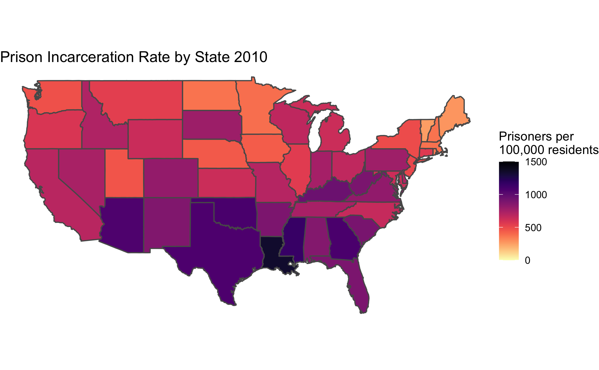

```{r setup, include = FALSE}
library(tidyverse)
library(kableExtra)
library(viridis)
library(scales)
library(readxl)
library(mdsr)
library(dplyr)
library(knitr)
library(ggplot2)
library(gganimate)
library(gifski)
library(janitor)
library(viridis)
library(sf)
library(tigris) # geojoin
library(leaflet) # interactive maps
library(htmlwidgets) # interactive map labels

# Set code chunk defaults 
knitr::opts_chunk$set(echo = FALSE, 
                      mesage = FALSE,
                      warning = FALSE,
                      fig.align = "center")

# Set R environment options
options(knitr.kable.NA = '')
incarceration_populations <-  read_csv("incarceration_populations.csv")
```

# Introduction
](img/Mass-Incarceration_TheNewYorker.jpeg)

**Mass incarceration** in the United States is a relatively recent phenomenon. As documented in books such as _The New Jim Crow: Mass Incarceration in the Age of Colorblindness_ and documentaries such as "13th", mass incarceration is the latest iteration of American society’s efforts to keep Black Americans, as well as other non-white racial and ethnic groups, in second-class citizenship status.

What makes mass incarceration unique is that the laws driving the disproportionate incarceration of Black Americans make no mention of race. Michelle Williams, the author of The New Jim Crow shows how The War on Drugs played a leading role in the incarcerated population rising by over 300% between 1980 and 2018 (Source: Bureau of Justice Statistics). In contrast, the population of the United States only increased by about 65% according to the US census. 

Mass incarceration has persisted even as the crime rate has been dropping consistently since the early 1990s. As a result, the United States currently makes up about 5% of the world’s population but has nearly 25% of the world’s prisoners.

Our project’s goal is to use datasets we acquired online to illustrate mass incarceration’s takeover **state-by-state** and **county-by-county** from 1970 onward. Most Americans know that mass incarceration exists, but few know when incarceration rates first spike in their community. More broadly, we hope the data science tools we have applied to the dataset help answer both broad and narrow questions about the when, where, and why of mass incarceration in America.

Our **framing questions** include:

* How has the total incarcerated population in the U.S. changed overtime?
* During the peak of incarceration in America, how does incarceration rates of each state compare to each other? Which states stand out, and why?
* Is there a disparity in incarceration rates among different racial/ethnic groups? If so, how large is the disparity? How does the disparity differ between different states?
* How does incarceration rates of each county compare to each other? Which counties stand out, and why?
* How can we develop a tool that will facilitate quick data research regarding specific demographic questions surrounding incarceration in America?

# Data
The datasets we used include incarceration trends by U.S. counties from 1970 - 2018 from [the Vera Institute of Justice](https://github.com/vera-institute/incarceration-trends), prison population counts from [the Bureau of Justice Statistics (BJS)](https://bjs.ojp.gov/data/key-statistics), incarceration rates and ratio by race from [the Prison Policy Initiative](https://www.prisonpolicy.org/racialgeography/report.html) and [the Sentencing Project](https://www.sentencingproject.org/the-facts/#map). 
All raw datasets are downloaded and imported into RStudio before the wrangling process. 

For developing interactive maps, we also downloaded the cartographic boundary shapefile of counties from the [U.S. Census Bureau](https://www.census.gov/geographies/mapping-files/time-series/geo/carto-boundary-file.html).

# Change in Incarceration Population
The “tough-on-crime” rhetoric characterized American politics during the 1980s and ’90s. It appeals to people's worst fears regarding their safety and perpetuates a framing that has justified for the racial profiling, police brutality, and unreasonably harsh sentencing that have together contributed to the rise of mass incarceration. Below, we utilized datasets that described population statistics surrounding incarceration from 1980 to 2018 to create an animation that shows the dramatic climbing of the population in prisons and jails. We juxtaposed trends of different variables to see the possibilities of associations among them and examine whether certain gaps are widening or closing. 

```{r, echo=FALSE, out.width = '100%', out.height = '50%'}

```

The visualization shows the amount of people under supervision, in jails and prisons in the United States from 1980 through 2018. The population under supervision grew **extremely fast** starting in 1980 and **peaked** in 2007 before it started slowly decreasing. The number of people almost **quadrupled**, from around 2,000,000 to almost 8,000,000, over the course of 30 years. The incarcerated population also grew dramatically fast between 1980 and 2007 from 500,000 to well over 2,000,000. Since then the incarcerated population has started to decrease but only slightly. The population in local jails and state prisons also grew significantly under the same time frame. 

Surprisingly, the federal prison population didn't grow much relatively. As mentioned in the Introduction, during the 1970s and ’80s, the federal government dramatically escalated its [war on drugs](https://www.history.com/topics/crime/the-war-on-drugs). This led to millions of people getting locked up for low-level drug offenses, causing the US prison population to spike. The standard narrative therefore goes: it's mainly the federal government that's behind mass incarceration. However, our findings help refute such myth. The prison system that the federal government runs is huge, but [many states](https://www.worldatlas.com/articles/the-largest-jails-in-the-united-states.html) also have systems that are fairly close to the federal one in size. Moreover, there are other types of correctional observation including local jail, parole, and probation. In light of all these massive state-operated structures, the federal prison falls out of first place in regards of leading mass incarceration.

Our findings also support the claim of Fordham University criminal justice expert [John Pfaff](https://www.vox.com/policy-and-politics/2017/5/30/15591700/mass-incarceration-john-pfaff-locked-in). "The federal government’s war on drugs never played much of a role in incarceration because the federal government just doesn’t play much of a role in incarceration overall," said Pfaff.

All 5 types of correctional observations display a trend of **slight decrease** starting in 2007. According to [PEW](https://www.pewtrusts.org/en/research-and-analysis/issue-briefs/2017/03/state-reforms-reverse-decades-of-incarceration-growth), since 2007, more than 30 states have enacted policies to **reverse** incarceration growth and costs, while maintaining the long-term, nationwide decline in the crime rate that began in the early 1990s. These changes are crucial for the dismantling of the prison industrial complex, while we also have to keep in mind that the United States remains as the world leader in its rate of incarceration, locking up its citizens at 5-10 times the rate of other industrialized nations. According to [the Sentencing Project](https://sentencingproject.salsalabs.org/the_daily_show_copy1?wvpId=f073b5eb-b9c5-11e7-b163-12c35146c141), at the current rate of decline it will take 75 years to cut the prison population by 50%.

Despite the slight descreases, these trends have continue to result in prison overcrowding and fiscal burdens on states to accommodate a rapidly expanding penal system, despite [increasing evidence](https://www.vera.org/downloads/publications/for-the-record-prison-paradox_02.pdf) that large-scale incarceration is not an effective means of achieving public safety.

Below is the main code that we used to make the time lapse visualization. First, we pivoted longer the incarceration populations dataset. Then, we used `ggplot` to create static plots that show trends of multiple variables and used `gganimate` to bring it from a static plot to a timelapse.

```{r animation code, echo = TRUE}
incarceration_populations_longer <- incarceration_populations %>%
  # select the columns needed for graphing
  select(year, total_supervised, total_incarcerated, local_jail, state_prison, federal_prison) %>%
  # pivot longer the `incarceration_populations` dataset to have all the variables
#under one column named "variables"
  pivot_longer(!year, names_to = "variables", values_to = "counts") %>%
  # convert entries under "variables" into factors
  mutate(variables = as.factor(variables),
         # take out the "_" between words
         variables = str_replace(variables, "_", " "))

# create a time-laspe using gganimate
incarceration_time_animation <- ggplot(data = incarceration_populations_longer, aes(x = year, y = counts)) + 
  geom_line(aes(group = variables, color = variables)) +
  # add title, subtitle, and labels for axis and legend
  labs(title = "Change in Incarceration Population Overtime",
       subtitle = "1980 - 2018",
       x = "Year",
       y = "Number of People",
       color = "Type") +
  # change font sizes for title, subtitle, legend, and x-axis labels
  theme(plot.title = element_text(family = "serif", size = 30),
        plot.subtitle = element_text(family = "serif", size = 24),
        legend.title = element_text(family = "serif", size = 18),
        legend.key.size = unit(1, 'cm'),
        legend.text = element_text(family = "serif", size = 14),
        # change the axis label sizes and adjust the label angle of the x axis
        axis.title = element_text(family = "serif", size = 18),
        axis.text.x = element_text(angle = 30, hjust = 1, size = 12),
        axis.text.y = element_text(size = 12)) +
  # adjust the max, min, and interval for both axes
  scale_y_continuous(breaks = seq(0, 7000000, by = 1000000),
                     labels = comma) +
  scale_x_continuous(breaks = seq(1980, 2018, by = 2)) +
  # set time laspe interval as by each year
  transition_reveal(year)
```


# Incarceration Rates by States (2010)
This data comes from the [Prison Policy Initiative](https://www.prisonpolicy.org/data/) and breaks down the incarceration rate by race/ethnicity.

```{r, echo=FALSE, out.width = '100%'}

```
This map shows incarceration rates near the peak of incarceration in the United States. In general, southern states had higher incarceration rates, but barely any states had incarceration rates below 500 prisoners per 100,000 residents. This is still extremely high considering that the [UN](https://www.prisonstudies.org/sites/default/files/resources/downloads/wppl_12.pdfestimates) that the average rate around the world is about 145 per 100,000.  To put this into perspective any state in the purple has 1% of its population behind bars.

We used this [dataset](https://www.prisonpolicy.org/data/race_ethnicity_gender_2010.xlsx) to make the heat map above. The code for wrangling the dataset and visualizing it is shown below. We wrangled the Prison Policy Initiative dataset in order to merge it with the states dataset from the maps package.

```{r heat map, echo = TRUE, eval=FALSE}
incarceration_rates_race <- read_csv("prison_policy_initiative_incarceration_by_race.csv")

#rename necessary columns
incarceration_rates_race <- incarceration_rates_race %>% rename(ID = "...3" ) %>% rename(rate_per_100 = "...26")
#delete United States row and remove states and territories not in Continental United States
incarceration_rates_race <- incarceration_rates_race %>% filter(ID!="United States", ID!="Puerto Rico", ID!="Geography", ID!="Hawaii", ID!="Alaska")
#Make state names lowercase to match geom dataset
incarceration_rates_race <- incarceration_rates_race %>% mutate(ID = tolower(incarceration_rates_race$ID))
#Take out commas from rates column
incarceration_rates_race$rate_per_100<-gsub(",","",as.character(incarceration_rates_race$rate_per_100))
#Convert rates column to numeric
incarceration_rates_race <- incarceration_rates_race  %>% mutate(rate_per_100 = as.numeric(rate_per_100))

#import geom dataset
state_map <- maps::map("state", plot = FALSE, fill = TRUE) %>% 
  st_as_sf()

state_info <- data.frame(Region = state.region,
                         # Match state variable name in map data
                         ID = tolower(state.name), 
                         # Match state variable name in summary data
                         State = state.abb)

#Join both datasets
incarceration_rates_race <- state_map %>% 
  left_join(state_info) %>% 
  left_join(incarceration_rates_race)

#GGplot Visialization
states<-ggplot(incarceration_rates_race, aes(fill = rate_per_100)) +
geom_sf() +
  scale_fill_viridis(option = "magma", direction = -1) +
  theme_void() +
  labs(title=" Prison Incarceration Rate by State 2010", fill = "Prisoners per \n100,000 residents")

```
# Racial Contrast

```{r, echo=FALSE, out.width = '100%'}
knitr::include_graphics("Incarceration_2020.png")
```

This [data](https://www.sentencingproject.org/the-facts/#map) was used for the map above. We manually made a dataset that listed all the ratios by state in order to make the dataset used for the visualization. 

Interestingly, when it comes to racial disparity in incarceration rates Southern states have much less disparity. Many of the states that are considered relatively liberal like California and New York actually have some of the higher rates of disparity. This could be in part to laws that are unique to each state. In the case of California, a law known colloquially as "Three Strike, You're Out". This law was designed to address habitual offenders by automatically increasing their sentence to 25 to life after committing three crimes. Only one of these crimes had to be serious or violent which has led many people to go to prison for non-violent offenses such as drug possession. According to a [study]((http://www.cjcj.org/uploads/cjcj/documents/three_strikes_the_new_apartheid.pdf)) conducted by the Center of Juvenile and Criminal Justice in 1996 only a year after the law's implementation found that black defendants made 43% of all three-strikes defendants.This obviously lead to even higher incarceration rates for Black Californians who already made up 31% of the state prisoner population at the time while only comprising 7% of California's total populations. On top of this the law has not been proven to reduce crime rates, but still remains in effect.

Wisconsin has an unusually high disparity. As this [article](https://www.nbcnews.com/news/us-news/wisconsin-leads-nation-imprisonment-rates-black-people-rcna4160) explains, that Wisconsin has some of the most residentially segregated counties in the country. This has made it easier for police to occupy neighborhoods that are almost entirely Black. As a result, about 1 in every 36 black residents in Wisconsin are currently in prison according to [a report by The Sentencing Project.](https://www.sentencingproject.org/wp-content/uploads/2016/06/The-Color-of-Justice-Racial-and-Ethnic-Disparity-in-State-Prisons.pdf)

New Jersey also has very high racial disparity. As discussed in this [article](https://www.nj.com/news/2021/10/nj-continues-to-have-worst-racial-disparities-nationwide-in-its-prisons-report-says.html), one possible cause for this are mandatory minimum sentences associated with non-violent drug offenses which have disproportionately affected Black and Latinx defendants. State leaders have begun to make active efforts to reduce the prison population, but over half of the prison population remains Black and Governor Phil Murphy has refused to address mandatory minimum sentencing directly.

# More Exploration through Shiny App {.tabset .tabset-fade .tabset-pills}

<iframe src ="https://adeatrick.shinyapps.io/blog_facts-and-stats" height=800px width=1000px></iframe>

## Histogram

## Interactive Map
To better visualize mass incarceration's take-over county by county, we created an interactive map using the `Leaflet` package. The data this visualization is based on is from [the Vera Institute of Justice](https://github.com/vera-institute/incarceration-trends) and consists of a total of $121$ demographic and geographic variables including `fips`, `total_pop_15to64`, and `total_jail_pop`. 

## Table

# Conclusion and Limitations

As discussed in the introduction, it is hard to pinpoint a singular cause for mass incarceration and racial disparities in incarceration rates across the country. When looking at three states with high racial disparity in incarceration rates, we found three very different laws and local circumstances that were contributing to this phenomenon. It's very hard to address any of the circumstances or laws head-on because none of them explicitly mention race. The disparity in incarceration often comes from how laws are enforced. Policing tactics that target Black and brown neighborhoods along with prosecutors who are often less lenient with Black and Latinx defendants cause much of the racial disparity in prison populations. So it would not be enough to simply rewrite laws that disproportionately affect marginalized population because they only represent one part of the systemic issue. Also it would not be effective to simply make incarceration rates equal across races. Even the incarceration rates for white residents in the vast majority of states are much higher than the global average incarceration rate. The United States has become overly dependent on prisons as a form of social control. It's an ineffective form of control, but many private companies who provide services like food for prisons have benefitted from luicrative government contracts. These private interests incentivize prisons to keep their populations as high as possible in order to maintain high demand for these services. It'll be very difficult to get rid of these private interests who have been very successful at lobbying. Only significant divestment in prisons will lower incarceration rates significantly. 


## Citations
* Alexander, Michelle. The New Jim Crow: Mass Incarceration in the Age of Colorblindness. New York, The New Press, 2010.
* Vera Institute. 2018. Incarceration Trends: GitHub; [2021 Nov].https://github.com/vera-institute/incarceration-trends. 
